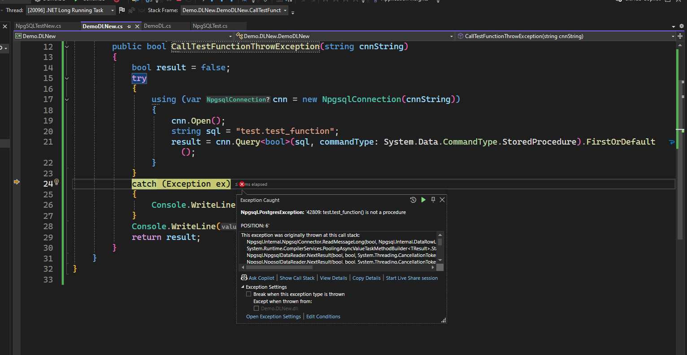

# npgsql-storeprocedural-error

project test về sự thay đổi dổi npgsql 7.0 không hỗ trợ việc execute function nữa

phải sử dụng select \* và commandtype là text để giải quyết vấn đề ngày, do bản npgsql 7.0 trở lên đã phân biệt rõ StoreProcedure chỉ để thực thi Procedure của PostgreSQL, không dùng để chạy Function

nguồn

https://www.npgsql.org/doc/release-notes/7.0.html#breaking-changes

Cách sửa

